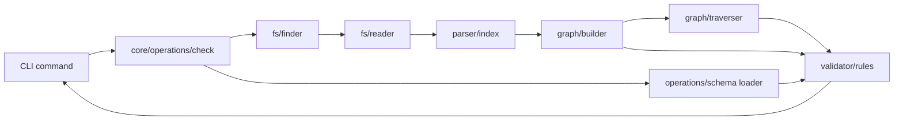
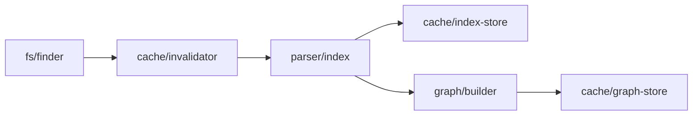

# Stem Product Requirements Document

## What Is Stem

Stem is a Git-native, file-based documentation system for software developers. Project knowledge is stored once as Markdown blocks and composed into multiple readable view files. The same canonical content can power onboarding docs, architecture docs, runbooks, API notes, and AI-agent context views without duplication.

## The Problem

Developer documentation gets stale, bloated, duplicated, and trapped in one organizational perspective. Teams need documentation that lives beside code, changes through Git, supports reuse, and exposes enough structure for LLM-based coding agents to navigate a codebase intelligently.

Stem addresses five recurring documentation failures together: staleness during active development, bloated single files, duplicated shared content, cascade updates across many documents, and the inability to organize the same knowledge from multiple perspectives.

## Target Users

Primary users are software developers documenting active codebases. Secondary post-MVP users include product managers, non-technical writers, editor integrations, UI tools, and MCP clients.

MVP is not aimed at enterprise technical writing teams, external product documentation, or end-user documentation portals.

## Core Concepts

### Block Store

The block store is the canonical source of reusable knowledge. It lives in `/blocks` and contains Markdown files with YAML frontmatter.

### Blocks

Blocks are smart containers. They can be plain prose, contain named sections, contain tagged content, or declare dependencies on other blocks. Blocks have globally unique IDs.

Blocks store only what they explicitly own. They do not store generated reverse pointers such as `used-in`.

### Sections

Sections group related content within one block:

```md
@stem[section:auth-flow]
@stem[tag:summary]
Short auth summary.
@stem[end]
@stem[end]
```

Sections are one level deep. A `section=` parameter must reference a section in the same block.

### Tags

Tags activate behavior on content:

```md
@stem[tag:summary]
Short version.
@stem[end]
```

Duplicate tags in the same section are allowed with a warning and are concatenated in document order.

### Tag Schemas

Optional YAML schemas live in `/blocks/schemas/`. Built-in MVP schemas are `adr` and `api`; teams may add their own.

### View Files

Views are the documents people read. They live in `/views`, can include local Markdown, and can transclude blocks with optional filters:

```md
@stem[block:auth-flow-block]
@stem[block:auth-flow-block section=auth-flow tag=summary]
```

Authors can write local content first and promote content into blocks only when reuse becomes valuable. All `@stem[block:]` references are transclusions; normal Markdown links remain the way to create non-embedding references.

### View File Groups

Subfolders under `/views` represent organizational perspectives such as `/views/by-audience/backend`.

### Dynamic Connection Graph

The graph is calculated by scanning blocks and views. It is never written to source Markdown or frontmatter, which avoids graph-maintenance merge conflicts.

The graph combines view-to-block references from view bodies and block-to-block `depends-on` references from block frontmatter. Circular `depends-on` relationships are warnings, not errors, because they describe staleness relationships rather than render-time embedding.

Graph nodes are blocks and views. A block node stores its ID, file paths, and block-level tags with `group: null`; a view node stores its ID, file paths, and group with an empty tags array.

Graph edges are either `view-uses-block` or `block-depends-on`. Both edge types preserve optional `section` and `tag` metadata so filtered references remain distinct relationships. Multiple filtered references from the same view to the same block create multiple edges.

The graph builder precomputes lookup maps for `blockUsedInViews`, `viewUsesBlocks`, `blockDependsOn`, and `blockDependents`. These maps power fast listing, impact analysis, delete warnings, and validation.

The builder records duplicate block/view IDs as graph build issues while keeping the first node. It still creates edges to missing nodes; the validator reports broken references later. Content embedding cycles are structurally impossible because views embed blocks and blocks never embed other blocks.

### Validator

The validator is a pure in-memory layer. It receives a `StemGraph`, parsed blocks, parsed views, graph build issues, loaded tag schemas, precomputed dependency cycles, and precomputed orphaned block IDs. It never reads files, loads schemas, parses Markdown, mutates the graph, or imports CLI code.

Validation errors are duplicate IDs, broken block references, broken section references, unresolved tags, and schema violations. Validation warnings are circular dependencies, orphaned blocks, and duplicate tags inside one section.

Parser issues such as invalid frontmatter and external tags that target missing sections are produced before graph validation and flow through operations separately. Schema files are loaded by operations and passed into the validator as a `Map` so schema validation stays pure and testable.

### Cache Architecture

The cache lives in `/.stem/cache/` and is gitignored. It uses hybrid stat plus SHA invalidation: compare `dev`, `inode`, `size`, and integer `mtimeMs` first; compute SHA only when stat data indicates a possible change.

Cache entries store `dev` and `inode` as strings to avoid 64-bit truncation. `mtimeMs` is integer-truncated before storage. The dynamic graph is persisted only as a regeneratable cache snapshot under `/.stem/cache/`.

Invalidation classifies discovered files as `added`, `changed`, `unchanged`, or `metadataChanged`. `metadataChanged` means filesystem metadata changed but SHA stayed the same, so operations can update cache metadata without reparsing. Cache entries not found in the discovered file set are `deleted`.

Missing cache files return empty cache state rather than errors. Invalid cache JSON returns an error because corruption should be visible. Unsupported cache or graph snapshot versions return empty/null state because cache output is regeneratable.

The cache module owns persistence-shape conversion through `toCachedBlock` and `toCachedView`, which strip positions and runtime-only parser fields before writing parsed data to disk.

### Markdown Rendering

`stem render` resolves view transclusions into plain Markdown output. Source views in `/views` are never modified; rendered Markdown is generated under `/rendered` by default and should not be committed unless a project intentionally publishes generated output.

`stem render view <view-id>` renders one view, `stem render view <view-id> --stdout` prints one rendered view without writing files, and `stem render all` renders every view while preserving view group paths under the output directory. `stem preview view <view-id>` is the authoring shortcut for printing the rendered view to the terminal without writing generated files. Rendering preserves view frontmatter, keeps local Markdown unchanged, fails on validation errors, and allows warnings.

### Block and View Deletion

`stem check` reports broken references. `stem delete block` warns when a block is referenced and requires `--force` to proceed. `stem delete view` removes a view file. Section-level deletion is not part of the current CLI surface.

### Parser Strategy

The parser must accept Markdown content, extract YAML frontmatter, recognize `@stem[...]` syntax, and produce typed `ParsedBlock` or `ParsedView` objects. It must resolve external tags through a two-pass section registry and ignore Stem examples inside inline code and fenced code blocks.

Recoverable content errors must be returned as validation issues so `stem check` can report multiple problems in one run rather than aborting at the first malformed reference.

The MVP `stem-plugin.ts` strategy has been spike-validated: parse standard Markdown with Remark, visit mdast `text` nodes with `unist-util-visit`, and replace recognized `@stem[...]` ranges with typed Stem AST nodes. This approach preserves ordinary Markdown structure and naturally isolates fenced code and inline code because Remark represents them as `code` and `inlineCode`, not transformable `text` nodes.

The spike recognized all supported reference forms, rejected empty, colonless, and unknown-type directives, preserved headings/paragraphs/lists, and produced source positions for extracted nodes. The production implementation enforces the MVP single-line grammar so directives cannot span newline boundaries; richer macro grammar can move to a micromark extension post-MVP if required.

## Reference Grammar

```txt
@stem[type:identifier params]
```

| Type             | Syntax                            | Purpose                     |
| ---------------- | --------------------------------- | --------------------------- |
| `block`          | `@stem[block:auth-flow-block]`    | Transclude a whole block    |
| `block` filtered | `@stem[block:id section=x tag=y]` | Transclude filtered content |
| `dep`            | `@stem[dep:block-id]`             | Declare a block dependency  |
| `dep` scoped     | `@stem[dep:block-id#section.tag]` | Declare a scoped dependency |
| `section`        | `@stem[section:name]`             | Define a section            |
| `tag`            | `@stem[tag:name]`                 | Define tagged content       |
| `tag` scoped     | `@stem[tag:name section=x]`       | Bind tag to a section       |
| `end`            | `@stem[end]`                      | Close a section or tag      |

Behavior rules:

| Situation                            | Behavior                              |
| ------------------------------------ | ------------------------------------- |
| Multiple tag matches across sections | Concatenate in document order         |
| Duplicate tag in same section        | Concatenate and warn                  |
| Missing block reference              | Error                                 |
| Missing section reference            | Error                                 |
| Missing tag reference                | Warning or typed unresolved-tag issue |
| Cross-block section membership       | Error                                 |
| Circular `depends-on`                | Warning, traversal uses visited set   |
| Syntax inside code spans/fences      | Ignored                               |

Parser rules:

- `@stem[]` inside inline code or fenced code blocks is ignored.
- `section=` on a tag must reference a section in the same block.
- Duplicate tags inside one section are deterministic: concatenate in document order with a newline separator and warn.
- Content embedding cycles are structurally impossible because views embed blocks, but blocks do not embed other blocks.

## ID Uniqueness Rules

Block IDs are globally unique across the block store. IDs are generated from filenames or titles, may be manually overridden, and must be changed with `stem rename` so references stay consistent.

## Folder Structure

```txt
stem/
  .stem/
    config.json        # root marker and version
    cache/             # dynamic graph cache, never committed
  blocks/
    schemas/           # versioned tag schemas
  views/
    by-audience/       # optional view groups
  rendered/            # generated Markdown output, normally ignored
  src/
    cli/               # thin command shell
    core/              # reusable library
```

## File Format

Block file:

```md
---
id: auth-flow-block
tags: [auth-domain, backend]
depends-on:
  - users-table-block
---

@stem[section:auth-flow]
@stem[tag:summary]
Authentication uses JWT tokens.
@stem[end]
@stem[end]
```

Plain block:

```md
---
id: onboarding-intro-block
tags: [onboarding]
---

Welcome to the project.
```

View file:

```md
---
id: auth-service-view
group: by-audience/backend
---

# Auth Service

@stem[block:auth-flow-block section=auth-flow tag=summary]
```

`.stem/config.json`:

```json
{
  "version": "1",
  "blocksDir": "blocks",
  "viewsDir": "views",
  "schemasDir": "blocks/schemas",
  "cacheDir": ".stem/cache"
}
```

All fields are optional in the raw config. Missing `version` defaults to `"1"`, and missing directory fields default to the values shown above. Config paths must be project-relative, are normalized to POSIX forward-slash format, and cannot be absolute or contain `..`.

## Frontmatter Schema

Block fields:

| Field        | Required | Notes                                 |
| ------------ | -------- | ------------------------------------- |
| `id`         | Yes      | Globally unique block ID              |
| `tags`       | No       | Block-level labels                    |
| `depends-on` | No       | Whole-block or scoped dependency refs |

View fields:

| Field   | Required | Notes               |
| ------- | -------- | ------------------- |
| `id`    | Yes      | Unique view ID      |
| `group` | No       | Path under `/views` |

## CLI Commands

| Command                                                    | Purpose                                                                        |
| ---------------------------------------------------------- | ------------------------------------------------------------------------------ |
| `stem init`                                                | Create `.stem`, `blocks`, `views`, built-in schemas, and gitignore cache entry |
| `stem init --force`                                        | Recreate scaffold files when they already exist                                |
| `stem create block <name>`                                 | Create a block                                                                 |
| `stem create block <name> --tag <tag>`                     | Create a block scaffolded for a schema tag                                     |
| `stem create view <name>`                                  | Create a view                                                                  |
| `stem create view <name> --group <path>`                   | Create a view inside a group                                                   |
| `stem create group <path>`                                 | Create a view group                                                            |
| `stem rename <old-id> <new-id>`                            | Rename a block ID and update references                                        |
| `stem render view <view-id>`                               | Render one view to Markdown                                                    |
| `stem render view <view-id> --stdout`                      | Print one rendered view without writing files                                  |
| `stem render all [--out <dir>]`                            | Render all views to Markdown                                                   |
| `stem preview view <view-id>`                              | Preview one rendered view in the terminal                                      |
| `stem delete block <id> [--force]`                         | Delete a block after reference checks                                          |
| `stem delete view <id>`                                    | Delete a view                                                                  |
| `stem add <block-id> to <view-id>`                         | Insert a block reference                                                       |
| `stem add <block-id> to <view-id> --section <s> --tag <t>` | Insert a filtered block reference                                              |
| `stem sync`                                                | Rebuild the dynamic graph cache                                                |
| `stem check`                                               | Read-only validation                                                           |
| `stem list blocks`                                         | List blocks with usage counts                                                  |
| `stem list blocks --tag <tag>`                             | Filter blocks by tag                                                           |
| `stem list views`                                          | List views and referenced blocks                                               |
| `stem list views --block <block-id>`                       | List views that reference a block                                              |

## MVP Scope

Included: block store, optional sections/tags, tag schemas, view files and groups, dynamic graph, hybrid stat plus SHA cache, two-pass parser, code-block isolation, Markdown rendering and terminal preview, `rename`, `check`, `sync`, list/create/add/delete/render/preview commands.

Post-MVP: MCP server, UI, editor extensions, preview/build, HTML export, GitHub Action publishing, live code references, external sources, parameterized blocks, aliases, localization, cross-project references.

## Success Criteria

- [x] `stem init` creates a working project scaffold.
- [x] Plain and tagged blocks can be created.
- [x] Views can reference whole blocks, sections, and tags.
- [x] Local view content works beside transclusions.
- [x] Parser ignores `@stem[]` inside code.
- [x] Two-pass parsing resolves external tag section membership.
- [x] `stem check` is read-only and reports structural issues.
- [x] `stem sync` rebuilds cache state and graph snapshots from source files.
- [x] `stem render` produces resolved Markdown without modifying source views.
- [x] `stem preview` prints resolved Markdown without writing generated files.
- [x] The graph is never written to source files.
- [x] `.stem/cache/` is gitignored by `stem init`.

## Tech Stack

| Area            | Choice                        |
| --------------- | ----------------------------- |
| Language        | TypeScript                    |
| Runtime         | Node.js ESM                   |
| Package manager | pnpm                          |
| CLI             | commander.js                  |
| Markdown        | remark and unified            |
| AST traversal   | unist-util-visit              |
| Frontmatter     | gray-matter                   |
| File scanning   | fast-glob                     |
| Testing         | vitest                        |
| Linting         | ESLint with TypeScript plugin |
| Formatting      | Prettier                      |
| Build           | tsup                          |

## System Architecture

Module structure:

```txt
src/cli -> src/core/operations -> fs/parser/graph/cache/validator/types
```

Data flow for `stem check`:



Data flow for `stem sync`:



## Type System

Types are organized by responsibility in `src/core/types`: position, ast, config, schema, block, view, graph, cache, validation, operations, and index. Cached types omit positions; parsed in-memory types include positions for diagnostics. The barrel exports types only.

Parser results carry validation issues alongside parsed objects so later `stem check` formatting can report every recoverable issue without aborting parsing.

## What Makes Stem Different

Stem combines reusable Markdown blocks, tag-filtered composition, view groups, a dynamic graph, cache safety across Git operations, and an AI-agent-friendly context model while staying file-based and Git-native.
